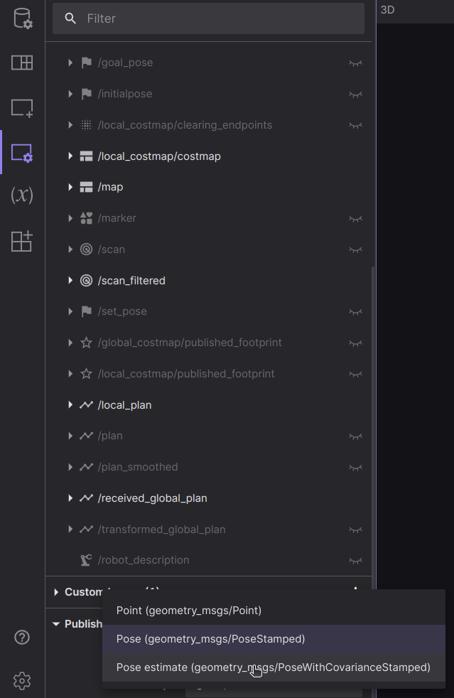
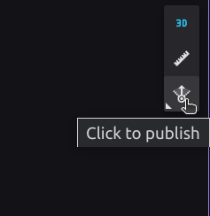
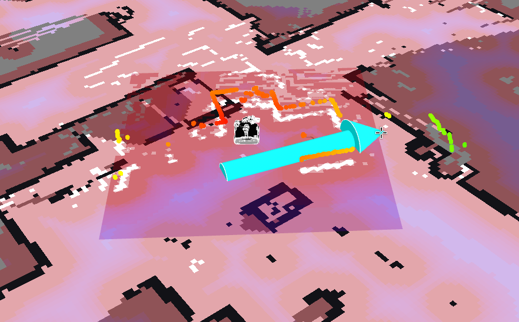

# rosbot-xl-iros-demo

ROSbot XL demo for IROS 2023 - manipulation combined with navigation.

<!-- SLAM_MODE=slam docker compose up
SLAM_MODE=localization docker compose up -->

## Running on the robot

Clone the repository to your computer and download necessary docker images:
```
docker compose -f compose.pc.yaml pull
```
Now power up the ROSbot XL and connect you computer to the `rosbotap` network, run `ssh husarion@192.168.78.1` and go into the `rosbot-xl-iros-demo` directory.
Before running the containers, check the following things:
* gamepad should be connected to the ROSbotXL
* make sure that antennas are tilted, so they won't collide with the manipulator.
* take the manipulator out of the dock and hold it in the starting position.
Now you're ready to run the mapping mode:
```
SLAM_MODE=slam docker compose up
```
After everything starts you can type in your browser:
```
http://192.168.78.1:8080/
```
to connect to the Foxglove.
You will additionally have to select the data source (plus sign in the left upper part, open new connection: `ws://192.168.78.1:9090`).
Now you should see the model and map.

To control manipulator you will have to run:
```
docker compose -f compose.pc.yaml up
```

Now you can drive around using gamped, after you are finished simply kill the containers.

After creating a map you can use localization mode (which also comes with autonomous navigation). Run:
```
SLAM_MODE=localization docker compose up
```

After eveyrthing launches connect to the Foxglove (as described above) and publish the initial pose:
* in the `Panel Settings` change publish type to `Pose estimate`: 


* select `Click to publish`


* select robot's position 



Now change the publish type back to `Pose` and make sure that topic is set to `/goal_pose`.
You can use the `Click to publish` to send goals to the robot.

## Simulation
```
SLAM_MODE=slam docker compose -f compose.simulation.yaml up
```
```
SLAM_MODE=localization docker compose -f compose.simulation.yaml up
```
